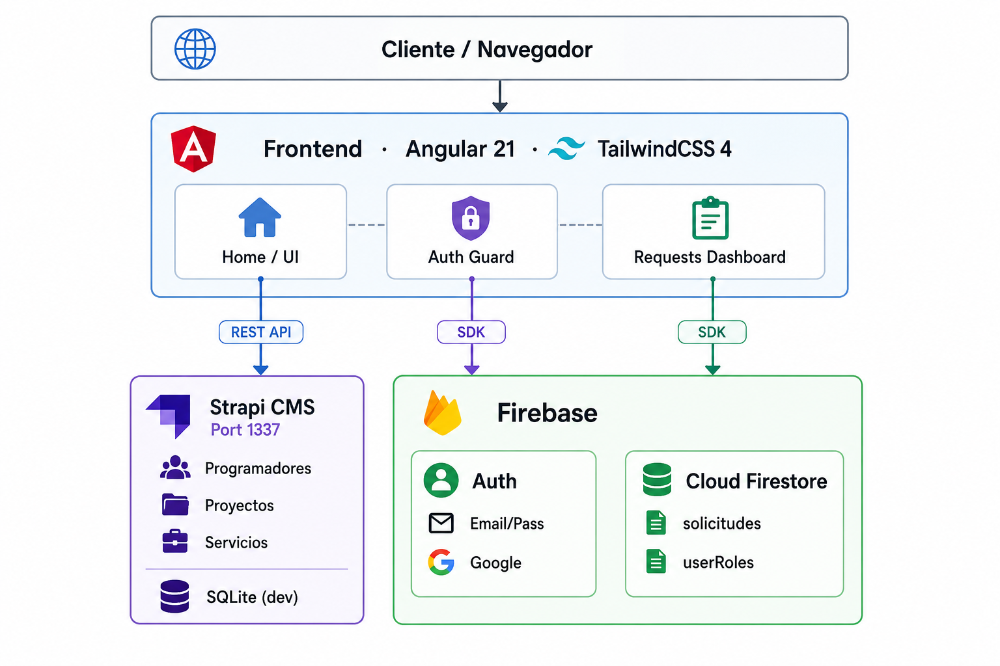

# DevDuo Portafolio — Aplicación Web de Servicios

 **Proyecto Integrador — Programación y Plataformas Web**  
 Universidad Politécnica Salesiana · Período Lectivo Marzo–Agosto 2026  
 Docente: Ing. Pablo Torres

---

## Tabla de Contenidos

1. [Descripción General](#1-descripción-general)
2. [Arquitectura del Sistema](#2-arquitectura-del-sistema)
3. [Stack Tecnológico](#3-stack-tecnológico)
4. [Estructura del Proyecto](#4-estructura-del-proyecto)
5. [Modelos de Datos](#5-modelos-de-datos)
6. [Rutas de la Aplicación](#6-rutas-de-la-aplicación)
7. [Roles y Flujos de Usuario](#7-roles-y-flujos-de-usuario)
8. [Variables de Entorno](#10-variables-de-entorno)
9. [Configuración de Firebase](#11-configuración-de-firebase)
10. [Reglas de Seguridad Firestore](#12-reglas-de-seguridad-firestore)
11. [Custom Claims — Sistema de Roles](#13-custom-claims--sistema-de-roles)
12. [API de Strapi — Endpoints](#14-api-de-strapi--endpoints)
13. [Despliegue](#15-despliegue)
14. [Guía de Usuario](#16-guía-de-usuario)
15. [Equipo](#17-equipo)

---

## 1. Descripción General

**DevDuo Portafolio** es una aplicación web tipo portafolio profesional multiusuario. Permite:

- Presentar los perfiles y proyectos de los dos programadores del equipo.
- Mostrar proyectos destacados con filtros de búsqueda y tecnología.
- Que usuarios externos autenticados envíen **solicitudes de contacto** a un programador.
- Que los programadores gestionen dichas solicitudes (cambiar estado, agregar observaciones).

La aplicación distingue tres niveles de acceso:

| Nivel | Descripción |
|---|---|
| **Público** | Navega el portafolio sin autenticarse (Home, perfiles, proyectos) |
| **Usuario Externo** | Se registra/autentica para enviar y ver el estado de sus solicitudes |
| **Programador** | Accede al panel de solicitudes recibidas y las gestiona |

---

## 2. Arquitectura del Sistema

<p align="center">
  
</p>

**Responsabilidades por capa:**

- **Angular** → Interfaz, consumo de APIs REST de Strapi, operaciones CRUD sobre Firestore, gestión de autenticación.
- **Strapi CMS** → Panel de administración de contenido dinámico (programadores, proyectos). Expone endpoints REST públicos.
- **Firebase Authentication** → Registro e inicio de sesión (Email/Contraseña + Google). Custom Claims para roles.
- **Cloud Firestore** → Almacenamiento NoSQL de solicitudes de contacto con reglas de seguridad por rol.

---

## 3. Stack Tecnológico

### Frontend

| Tecnología | Versión | Uso |
|---|---|---|
| Angular | 21.2 | Framework principal (standalone components, signals) |
| AngularFire | 20.0 | Integración oficial Firebase para Angular |
| Firebase SDK | 12.14 | Auth + Firestore cliente |
| TailwindCSS | 4.3 | Estilos utilitarios, diseño responsive |
| Angular SSR | 21.2 | Server-Side Rendering con Express |
| TypeScript | 5.9 | Tipado estático |
| RxJS | 7.8 | Programación reactiva (Observables, BehaviorSubject) |

### Backend

| Tecnología | Versión | Uso |
|---|---|---|
| Strapi | 5.47.1 | CMS Headless, REST API automática |
| better-sqlite3 | 12.8.0 | Base de datos local en desarrollo |
| Node.js | ≥ 18 | Runtime |

### Servicios en la Nube

| Servicio | Plan | Uso |
|---|---|---|
| Firebase Authentication | Spark (gratis) | Autenticación de usuarios |
| Cloud Firestore | Spark (gratis) | Solicitudes de contacto |
| Strapi Cloud / Railway | Free tier | Hosting del CMS |
| Firebase Hosting | Spark (gratis) | Deploy del frontend |

---

## 4. Estructura del Proyecto

```
portafolio/
├── frontend/                        ← Proyecto Angular
│   ├── src/
│   │   ├── app/
│   │   │   ├── app.config.ts        ← Providers: Firebase, Router, HttpClient
│   │   │   ├── app.routes.ts        ← Definición de rutas SPA
│   │   │   ├── app.ts               ← Componente raíz (Navbar + RouterOutlet + Footer)
│   │   │   ├── core/
│   │   │   │   └── services/
│   │   │   │       └── api.ts       ← ApiService: llamadas HTTP a Strapi
│   │   │   ├── models/
│   │   │   │   └── data.models.ts   ← Interfaces Programador y Proyecto
│   │   │   ├── features/
│   │   │   │   ├── home/            ← Página principal (hero, devs, proyectos, CTA)
│   │   │   │   ├── login/           ← Login + Registro (Email/Google)
│   │   │   │   ├── navbar/          ← Barra de navegación
│   │   │   │   ├── footer/          ← Pie de página
│   │   │   │   ├── profile/         ← Perfil individual del programador
│   │   │   │   ├── requests/
│   │   │   │   │   ├── dashboard/   ← Lista de solicitudes (externo/programador)
│   │   │   │   │   └── nueva-solicitud/ ← Formulario nueva solicitud
│   │   │   │   └── proyectos/
│   │   │   │       └── detalle-proyecto/ ← Vista detalle de proyecto
│   │   │   └── shared/
│   │   │       └── components/
│   │   │           ├── button-component/
│   │   │           ├── card-component/
│   │   │           ├── dev-card/    ← Tarjeta resumen del programador
│   │   │           ├── footer-dev/
│   │   │           └── project-card/ ← Tarjeta resumen del proyecto
│   │   ├── environments/
│   │   │   ├── environment.ts           ← Producción
│   │   │   └── environment.development.ts ← Desarrollo (Firebase config)
│   │   └── styles.css
│   ├── package.json
│   └── angular.json
│
├── backend/                         ← Proyecto Strapi
│   ├── src/
│   │   └── api/
│   │       ├── programador/
│   │       │   ├── content-types/programador/schema.json
│   │       │   ├── controllers/programador.ts
│   │       │   ├── routes/programador.ts
│   │       │   └── services/programador.ts
│   │       └── proyecto/
│   │           ├── content-types/proyecto/schema.json
│   │           ├── controllers/proyecto.ts
│   │           ├── routes/proyecto.ts
│   │           └── services/proyecto.ts
│   ├── config/
│   │   ├── database.ts  ← SQLite (dev) / PostgreSQL (prod)
│   │   └── middlewares.ts ← CORS, seguridad, logger
│   ├── public/uploads/  ← Imágenes subidas desde el panel
│   ├── .env
│   └── package.json
│
└── firestore.rules      ← Reglas de seguridad Firestore
```

---

## 5. Modelos de Datos

### 5.1 Strapi — Content Type: `Programador`

| Campo | Tipo Strapi | Descripción |
|---|---|---|
| `Nombre` | string | Nombre completo |
| `Especialidad` | string | Perfil profesional (ej. "Ciberseguridad") |
| `Descripcion` | string | Descripción breve para tarjetas |
| `Descripcion_completa` | blocks | Texto enriquecido para la página de perfil |
| `Foto_perfil` | media (single) | Imagen de perfil |
| `Correo_contacto` | email | Correo visible en el portafolio |
| `Redes_sociales` | json | `{ "github": "...", "linkedin": "..." }` |
| `Estado` | boolean | Si está activo y visible en el portafolio |
| `Slug` | uid (→ Nombre) | Identificador URL-amigable para navegación |
| `proyectos` | manyToMany → Proyecto | Proyectos relacionados (bidireccional) |

### 5.2 Strapi — Content Type: `Proyecto`

| Campo | Tipo Strapi | Descripción |
|---|---|---|
| `Titulo` | string (required) | Nombre del proyecto |
| `Slug` | uid (→ Titulo) | Identificador para URL |
| `Descripcion_breve` | string | Texto para tarjetas resumen |
| `Descripcion_completa` | blocks | Texto enriquecido detallado |
| `Imagen` | media (single) | Imagen principal del proyecto |
| `Tipo_proyecto` | enum | `academico` / `personal` / `laboral` / `simulado` |
| `Tecnologias` | json | Array de strings: `["Angular", "Firebase"]` |
| `Enlace_repo` | string | URL al repositorio de GitHub |
| `Enlace_demo` | string | URL al demo desplegado |
| `Destacado` | boolean | `true` = aparece en la sección Home |
| `programadores` | manyToMany → Programador | Autores del proyecto |

> **Relación bidireccional:** Un proyecto puede pertenecer a ambos programadores simultáneamente. Si el Proyecto X tiene a `programadorA` y `programadorB` en su relación, aparecerá en el perfil de los dos.

### 5.3 Firestore — Colección: `solicitudes`

```ts
interface Solicitud {
  // Datos del formulario
  nombre:      string;   // Nombre del solicitante
  proyecto:    string;   // Nombre del proyecto propuesto
  descripcion: string;   // Descripción detallada (mín. 10 chars)
  programador: string;   // Nombre del programador destino

  // Metadata automática
  userId:      string;   // UID de Firebase del solicitante
  fecha:       string;   // Fecha de creación (toLocaleDateString)
  estado:      'Pendiente' | 'Aprobado' | 'Denegado';

  // Campos opcionales que agrega el programador
  observacion?: string;  // Respuesta/observación del programador
  updatedAt?:  string;   // Fecha de última actualización
}
```

---

## 6. Rutas de la Aplicación

| Ruta | Componente | Acceso | Descripción |
|---|---|---|---|
| `/` | `Home` | Público | Hero, perfiles, proyectos destacados, CTA |
| `/login` | `Login` | Público | Inicio de sesión + registro de usuarios |
| `/profile/:slug` | `Profile` | Público | Perfil completo del programador y sus proyectos |
| `/proyecto/:slug` | `DetalleProyectoComponent` | Público | Detalle completo de un proyecto |
| `/requests` | `Dashboard` | Autenticado | Panel de solicitudes (vista según rol) |
| `/requests/nueva` | `NuevaSolicitud` | Autenticado | Formulario para crear solicitud |
| `/requests/editar/:id` | `NuevaSolicitud` | Autenticado | Edición de solicitud existente |

---

## 7. Roles y Flujos de Usuario

### 7.1 Usuario Público (sin sesión)

```
Home → Navega perfiles → Ver perfil individual
     → Navega proyectos → Ver detalle proyecto
     → Intenta "Mandar Solicitud" → Redirige a /login
```

### 7.2 Usuario Externo (autenticado)

```
Registro en /login (solo externos) → Redirige a /requests
/requests → Ve tabla "Mis Solicitudes" con estados
Nueva Solicitud → Formulario → Guarda en Firestore → Vuelve a /requests
Al hacer clic en una solicitud → Ve detalle + observación del programador
```

### 7.3 Programador (Custom Claim: role = 'programador')

```
Login en /login → Redirige a /requests
/requests → Pestaña "Solicitudes Recibidas" (filtradas por su nombre)
Al hacer clic en una → Formulario de detalle:
  - Cambia estado: Pendiente / Aprobado / Denegado
  - Escribe observación/respuesta
  - Guarda cambios en Firestore
```

**Diferenciación visual de estados:**

| Estado | Color de badge |
|---|---|
| Pendiente | Amarillo (`bg-yellow-500/10 text-yellow-500`) |
| Aprobado | Verde (`bg-green-500/10 text-green-500`) |
| Denegado | Rojo (`bg-red-500/10 text-red-500`) |

---

## 8. Variables de Entorno

### Backend — `backend/.env`

```env
HOST=0.0.0.0
PORT=1337

# Claves de seguridad de Strapi (generar valores únicos)
APP_KEYS="clave1,clave2,clave3,clave4"
API_TOKEN_SALT=un_salt_aleatorio
ADMIN_JWT_SECRET=otro_secreto_seguro
TRANSFER_TOKEN_SALT=otro_salt
JWT_SECRET=jwt_secreto
ENCRYPTION_KEY=clave_encriptacion
```

> Se generó valores seguros con: `node -e "console.log(require('crypto').randomBytes(32).toString('base64'))"`

### Frontend — `src/environments/environment.development.ts`

```ts
export const environment = {
  production: false,
  firebaseConfig: {
    apiKey:            "TU_API_KEY",
    authDomain:        "TU_PROJECT.firebaseapp.com",
    projectId:         "TU_PROJECT_ID",
    storageBucket:     "TU_PROJECT.firebasestorage.app",
    messagingSenderId: "TU_SENDER_ID",
    appId:             "TU_APP_ID",
    measurementId:     "G-XXXXXXXXXX"
  }
};
```

Se obtuvieron estos valores desde la **Consola de Firebase** → Configuración del proyecto → App web.

---

## 9. Configuración de Firebase

### 9.1 Autenticación

En la Consola de Firebase, se habilitó los siguientes proveedores:

`Authentication → Sign-in method → Habilitar:`
- ✅ **Email/Password**
- ✅ **Google**

### 9.2 Crear cuentas de los Programadores

Las cuentas de los programadores se crean **manualmente** en Firebase Authentication (no mediante el formulario de registro de la app, que es exclusivo para usuarios externos):

`Authentication → Users → Add user`

| Email | Contraseña |
|---|---|
| `joehv33@gmail.com` | (contraseña segura) |
| `alexpaucar.887@gmail.com` | (contraseña segura) |

### 9.3 Cloud Firestore

Se creaó la base de datos:
`Firestore Database → Create database → Start in production mode`

---

## 10. Reglas de Seguridad Firestore

 `Firestore → Rules`:

```javascript
rules_version = '2';

service cloud.firestore {
  match /databases/{database}/documents {

    function isAuthenticated() {
      return request.auth != null;
    }

    // Opción A: Custom Claims (recomendado — ver sección 13)
    function isProgramador() {
      return isAuthenticated() && request.auth.token.role == 'programador';
    }

    // Opción B: Lista blanca por email (alternativa inmediata)
    function isProgramadorByEmail() {
      return isAuthenticated() && request.auth.token.email in [
        'joehv33@gmail.com',
        'alexpaucar.887@gmail.com'
      ];
    }

    function isOwner(docUserId) {
      return isAuthenticated() && request.auth.uid == docUserId;
    }

    match /solicitudes/{solicitudId} {

      allow read: if isAuthenticated() && (
        isOwner(resource.data.userId) ||
        isProgramador()               ||
        isProgramadorByEmail()
      );

      allow create: if isAuthenticated() &&
        request.resource.data.userId == request.auth.uid &&
        request.resource.data.estado  == 'Pendiente'     &&
        request.resource.data.keys().hasAll([
          'nombre', 'descripcion', 'programador',
          'userId', 'fecha', 'estado'
        ]);

      allow update: if (isProgramador() || isProgramadorByEmail()) &&
        request.resource.data.diff(resource.data)
          .affectedKeys()
          .hasOnly(['estado', 'observacion', 'updatedAt']) &&
        request.resource.data.estado in ['Pendiente', 'Aprobado', 'Denegado'];

      allow delete: if false;
    }

    match /userRoles/{userId} {
      allow read:  if isAuthenticated() && request.auth.uid == userId;
      allow write: if false;
    }
  }
}
```

---

## 11. Custom Claims — Sistema de Roles

Para distinguir programadores de usuarios externos en Angular, se utilizan **Custom Claims** de Firebase. Este proceso se ejecuta **una sola vez** con el Admin SDK.

### 11.1 Obtener la clave de servicio

En Firebase Console → Configuración del proyecto → Cuentas de servicio → **Generar nueva clave privada**.

Guarda el archivo como `serviceAccountKey.json` (nunca lo subas a GitHub).

### 11.2 Script para asignar el claim

`set-claims.js`:

```js
const admin = require('firebase-admin');
const serviceAccount = require('./serviceAccountKey.json');

admin.initializeApp({
  credential: admin.credential.cert(serviceAccount)
});

const PROGRAMMER_EMAILS = [
  'joehv33@gmail.com',
  'alexpaucar.887@gmail.com'
];

async function assignClaims() {
  for (const email of PROGRAMMER_EMAILS) {
    try {
      const user = await admin.auth().getUserByEmail(email);
      await admin.auth().setCustomUserClaims(user.uid, { role: 'programador' });
      console.log(`Claim asignado exitosamente a: ${email}`);
    } catch (error) {
      console.error(`Error con ${email}:`, error.message);
    }
  }
  process.exit(0);
}

assignClaims();
```

```bash
node set-claims.js
```

### 11.3 Leer el claim en Angular

En el componente o servicio donde se necesitó verificar el rol:

```ts
import { Auth } from '@angular/fire/auth';
import { inject } from '@angular/core';

const auth = inject(Auth);

// Verificar si el usuario es programador
async function checkRole(): Promise<boolean> {
  const idTokenResult = await auth.currentUser?.getIdTokenResult();
  return idTokenResult?.claims['role'] === 'programador';
}
```

> **Importante:** El token se actualiza cada hora. Para forzar la actualización inmediata después de asignar el claim, se usa `getIdToken(true)`.

---

## 12. API de Strapi — Endpoints

El frontend consume los siguientes endpoints REST de Strapi. Todos son **públicos** (sin autenticación, configurados en el panel de Strapi).

### Obtener todos los programadores

```
GET /api/programadors?populate=*
```

Respuesta: `{ data: Programador[], meta: {...} }`

### Obtener programador por slug

```
GET /api/programadors?filters[Slug][$eq]={slug}&populate[Foto_perfil]=true&populate[proyectos][populate]=Imagen
```

### Obtener proyectos destacados

```
GET /api/proyectos?filters[Destacado][$eq]=true&populate=*
```

### Obtener proyecto por slug

```
GET /api/proyectos?filters[Slug][$eq]={slug}&populate=*
```

**Parámetros de populate comunes:**

| Parámetro | Qué incluye |
|---|---|
| `populate=*` | Todos los campos relacionados (media, relaciones) |
| `populate[Foto_perfil]=true` | Solo la foto de perfil |
| `populate[proyectos][populate]=Imagen` | Proyectos y su imagen |

---

## 13. Despliegue


---

## 14. Guía de Usuario

### Para Usuarios Externos

1. **Explorar el portafolio** → Visita la página principal en la URL pública. Puedes ver los perfiles de los programadores y los proyectos sin necesidad de cuenta.

2. **Registrarse** → Haz clic en "Iniciar Sesión" en la barra de navegación → Selecciona la pestaña "Registrarse" → Ingresa tu correo y contraseña (mínimo 6 caracteres).

3. **Enviar una solicitud** → Desde el Home, haz clic en "Mandar Solicitud" → Completa el formulario con tu nombre, proyecto, descripción y selecciona el programador → Haz clic en "Enviar Solicitud".

4. **Ver tus solicitudes** → Ve a "Mis Solicitudes" desde la navbar → Verás una tabla con todas tus solicitudes y su estado actual (Pendiente / Aprobado / Denegado) junto con la observación del programador.

### Para Programadores

1. **Iniciar sesión** → Usa tu correo y contraseña asignados (`joehv33@gmail.com` o `alexpaucar.887@gmail.com`).

2. **Ver solicitudes recibidas** → Al iniciar sesión, accede a "Mis Solicitudes". Verás las solicitudes que usuarios externos te han enviado a ti.

3. **Gestionar una solicitud** → Haz clic en una solicitud para abrirla → Cambia el estado (Pendiente / Aprobado / Denegado) → Escribe una observación o respuesta → Guarda los cambios.

4. **Administrar el contenido del portafolio** → Accede a `http://localhost:1337/admin` (o la URL de Strapi Cloud) → Desde el panel de Strapi puedes crear, editar y eliminar programadores y proyectos.

### Para el Administrador de Contenido (Strapi)

**Agregar un nuevo programador:**

1. Panel Strapi → Content Manager → Programador → Create new entry
2. Completar todos los campos requeridos
3. En "proyectos", seleccionar los proyectos relacionados
4. Hacer clic en "Save" y luego en "Publish"

**Agregar un nuevo proyecto:**

1. Panel Strapi → Content Manager → Proyecto → Create new entry
2. Completar los campos, activar "Destacado" si debe aparecer en Home
3. En "programadores", seleccionar los autores del proyecto (puede ser uno o ambos)
4. Hacer clic en "Save" y luego en "Publish"

---

## 15. Equipo

| Integrante | Email | Especialidad |
|---|---|---|
| **Alexander Paucar** | alexpaucar.887@gmail.com | Ciberseguridad |
| **Esteban Hernández** | joehv33@gmail.com | Networking |

---

<div align="center">

**Universidad Politécnica Salesiana**  
Carrera de Computación · Período Lectivo Marzo–Agosto 2026  
Asignatura: Programación y Plataformas Web  
Docente: Ing. Pablo Torres

</div>